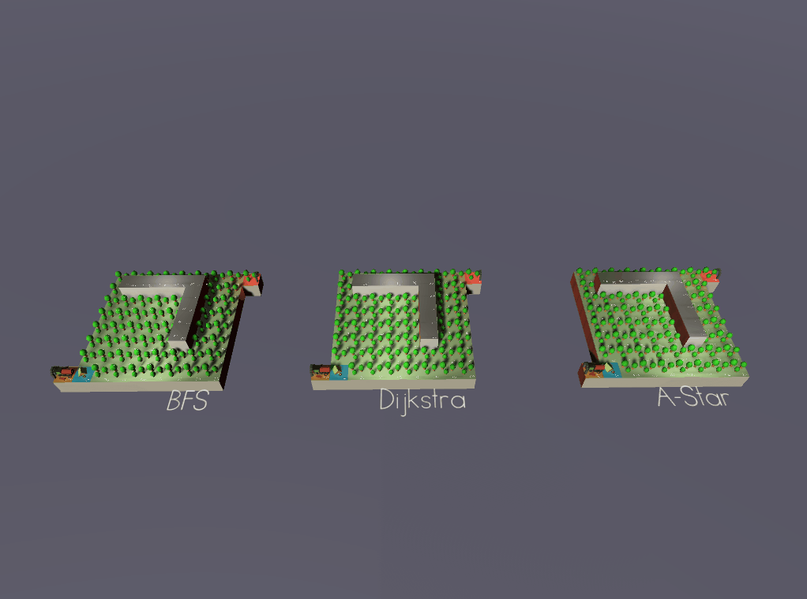

# Animated Path Finding Algorithm BFS Dijkstra A-star

## Three Path Finding Algorithm Combined

### Description
This is a Unity project that animates three common pathfinding algorithm: **BFS, Dijkstra, and A-star**. 

It uses different models (house, tent, train tracks, gate) and visual effects (plasma) to visualize the pathfinding process.

The pathfinding begins with a glowing start gate. Higher ground means larger cost to get there. All cells are covered with forest. Exploration team builds tents when they first reaches a cell ("open-list"). Then cell already explored are filled with house ("close-list"). Finally, rail tracks is built on the best path found and our train goes to the destination glowing red light.

When first learned these algorithm, I always want to have a direct and appealing visualization of them. Today, I did that myself. Anyone is welcome to download and play with it in Unity.

Here are some classical scenes I pre-made in the project to show differences between these algorithms.

We can see that A-star is the fastest and it generally explores less grid cells while BFS is going everywhere as it can.
 
  

Plasma when exploring new locations:
  

Picture of Models
  

### How to Modify Scenes in Unity
You can start by copying any of the existing scenes. 

Each grid cell automatically snap to grid even in edit mode. `cost` indicates how many efforts it takes from four directions to this cell. `Cost Random` will randomize its cost and `IsWall` will make this cell inaccessible no matter what.

For each path-finding agent prefab `Enemy`, we need to set `Board For Search`, `Start Way Point`, `End Way Point`. `Execute Per Frame` means the algorithm put one cell in closed-list each frame no matter what. If not chosen, the agent wait `Step per second` for each step. If `Execute Wait For Key` is set true, all agents wait for the key input in `Key Enum`. You can turn on and off plasma effect in `VFX` at your will.  

All models are extracted from ObjectPooler. If it runs super slow, you can consider: 1. cancelling spawning these models from pool; 2. modify pool parameters to pre-make more objects.

### Limits
This project is more like path-finding in game: more like a chess-board instead of irregular graphs. All of these algorithms didn't include different costs involving directions. 

A-star algorithm didn't consider directions like south-east, north-west etc.

### Code
`PathFinder.cs` is where three algorithms are included, I tried to keep them as simple as possible. I didn't actually maintain a close list or open list. Instead, each cell has an `enum` to keep track of its own status and corresponding `set` method to modify them. 

### Future Improvements
add customizable menu and make it an executable program?
